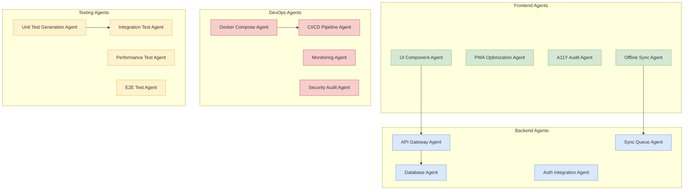

# AI Agents Specification for Budget Planner PWA

## Overview

This document specifies AI agents designed to assist in the development, maintenance, and scaling of the Budget Planner PWA - an offline-first progressive web application with SvelteKit frontend and Go backend. These agents are organized by domain and provide comprehensive automation capabilities.

## Agent Architecture

### System Context

---

## 1. Core Implementation Agents

### 1.1 Offline Sync Agent
**Purpose:** Handles offline-first synchronization, conflict resolution, and data consistency between frontend IndexedDB and backend PostgreSQL.
**Capabilities:**
- Queue management for sync operations
- Conflict detection and resolution (timestamp-based, owner-priority)
- Retry logic with exponential backoff
- Network state monitoring
- Data validation before sync
**Tools:** IndexedDB API, WebSocket/HTTP clients, network status API
**Integration:** Frontend sync queue, backend sync_operations table

### 1.2 Auth Integration Agent
**Purpose:** Manages Clerk authentication, token refresh, and session persistence.
**Capabilities:**
- JWT token validation and refresh
- Session synchronization across tabs
- Automatic reauthentication on token expiry
- Permission escalation/downgrade based on roles
- Logout behavior across devices
**Tools:** Clerk SDK, localStorage/IndexedDB, HTTP interceptors
**Integration:** Authentication middleware, user sessions

### 1.3 UI Component Agent
**Purpose:** Generates consistent, accessible Svelte components using Shadcn-Svelte patterns.
**Capabilities:**
- Component template generation
- Accessibility compliance (ARIA labels, keyboard navigation)
- Dark/light theme support
- State management integration
- Form validation patterns
**Tools:** Shadcn-Svelte, Tailwind CSS, Svelte compilers
**Integration:** Component library, design system

---

## 2. Backend & Database Agents

### 2.1 API Gateway Agent
**Purpose:** Manages REST endpoint lifecycle, validation, and documentation.
**Capabilities:**
- Route generation from database schema
- Input validation (JSON schema, custom validators)
- Rate limiting implementation
- Request/response transformation
- OpenAPI/Swagger documentation
**Tools:** Go Chi router, sqlc, validation libraries
**Integration:** HTTP handlers, middleware chain

### 2.2 Database Agent
**Purpose:** Optimizes SQL queries, manages migrations, and ensures data integrity.
**Capabilities:**
- SQL query optimization and indexing recommendations
- Migration script generation
- Data consistency checks
- Connection pool management
- Backup/restore procedures
**Tools:** PostgreSQL, sqlc, pg_stat_statements, migration tools
**Integration:** Database models, query files

### 2.3 Sync Queue Agent (Backend)
**Purpose:** Processes sync operations from frontend, resolves conflicts at server-side.
**Capabilities:**
- Process sync_operations table entries
- Apply changes with transaction isolation
- Generate conflict notifications
- Maintain operation logs for audit
- Cleanup completed/failed operations
**Tools:** PostgreSQL advisory locks, transaction management
**Integration:** Sync service, notification system

---

## 3. Testing & Quality Agents

### 3.1 Unit Test Generation Agent
**Purpose:** Creates comprehensive unit tests for Go backend and Svelte frontend.
**Capabilities:**
- Test case generation from function signatures
- Mock data generation
- Edge case identification
- Code coverage analysis
- Performance benchmarking
**Tools:** Go test, Svelte Testing Library, Jest, benchmarking tools
**Integration:** CI/CD pipeline, code review process

### 3.2 Integration Test Agent
**Purpose:** Tests system integration points and end-to-end workflows.
**Capabilities:**
- API endpoint testing
- Database integration tests
- Authentication flow testing
- Sync operation testing
- Multi-user scenario simulations
**Tools:** Postman/Newman, Docker test environments, test containers
**Integration:** Integration test suite, staging environment

### 3.3 Security Audit Agent
**Purpose:** Identifies security vulnerabilities and compliance issues.
**Capabilities:**
- SQL injection detection
- XSS vulnerability scanning
- Authentication bypass testing
- CORS policy verification
- Data encryption validation
**Tools:** OWASP ZAP, security linters, dependency scanners
**Integration:** Security review process, deployment gates

### 3.4 Performance Agent
**Purpose:** Analyzes PWA metrics and system performance.
**Capabilities:**
- Lighthouse audits
- IndexedDB performance analysis
- Network usage optimization
- Bundle size analysis
- Memory leak detection
**Tools:** Lighthouse, Chrome DevTools, performance monitoring
**Integration:** Performance budgets, deployment criteria

---

## 4. Deployment & DevOps Agents

### 4.1 Docker Compose Agent
**Purpose:** Manages multi-container development and deployment environments.
**Capabilities:**
- Dockerfile generation for Go/SvelteKit
- Compose file orchestration
- Volume and network configuration
- Development vs production configurations
- Health check implementation
**Tools:** Docker, Docker Compose, container registries
**Integration:** Development workflow, deployment pipeline

### 4.2 CI/CD Pipeline Agent
**Purpose:** Automates testing, building, and deployment processes.
**Capabilities:**
- GitHub Actions workflow generation
- Multi-stage deployment (dev/staging/prod)
- Rollback procedures
- Artifact management
- Environment variable management
**Tools:** GitHub Actions, Docker Hub, deployment scripts
**Integration:** Version control, deployment environments

### 4.3 Monitoring Agent
**Purpose:** Monitors application health, errors, and user behavior.
**Capabilities:**
- Log aggregation and analysis
- Error tracking and alerting
- Performance metric collection
- User behavior analytics
- System resource monitoring
**Tools:** Prometheus, Grafana, error tracking services
**Integration:** Production environment, alerting systems

---

## 5. Maintenance & Evolution Agents

### 5.1 Code Review Agent
**Purpose:** Enforces code quality standards and best practices.
**Capabilities:**
- Code style enforcement (Go/Svelte)
- Architectural pattern validation
- Dependency version checking
- Documentation completeness
- Complexity analysis
**Tools:** Linters, static analyzers, code review tools
**Integration:** Pull request workflow, development standards

### 5.2 Migration Agent
**Purpose:** Manages database schema evolution and data migrations.
**Capabilities:**
- Schema diff analysis
- Migration script generation
- Data transformation logic
- Rollback procedure creation
- Migration testing
**Tools:** Migration frameworks, database comparison tools
**Integration:** Release process, database maintenance

### 5.3 Documentation Agent
**Purpose:** Automates documentation generation and maintenance.
**Capabilities:**
- API documentation from Go code
- Component documentation from Svelte files
- Architecture diagram updates
- User guide generation
- Change log management
**Tools:** OpenAPI generators, documentation frameworks
**Integration:** Documentation site, knowledge base

---

## 6. Specialized Feature Agents

### 6.1 Analytics Agent
**Purpose:** Analyzes spending patterns and provides insights.
**Capabilities:**
- Spending trend analysis
- Budget adherence scoring
- Anomaly detection
- Predictive forecasting
- Visualization generation
**Tools:** Data analysis libraries, charting libraries
**Integration:** Dashboard, reporting system

### 6.2 Sharing Agent
**Purpose:** Manages budget sharing invitations and permissions.
**Capabilities:**
- Invitation generation and delivery
- Permission synchronization
- Access revocation
- Usage auditing
- Conflict resolution for shared edits
**Tools:** Email services, permission systems
**Integration:** Sharing workflow, notification system

### 6.3 Reflection Agent
**Purpose:** Manages reflection templates and analyzes user responses.
**Capabilities:**
- Template management and versioning
- Sentiment analysis from answers
- Trend identification across reflections
- Question optimization based on engagement
- Privacy filtering for shared reflections
**Tools:** NLP libraries, template engines
**Integration:** Reflection system, analytics pipeline

---

## 7. Agent Coordination & Communication

### 7.1 Agent Orchestrator
**Purpose:** Coordinates agent activities and manages dependencies.
**Capabilities:**
- Workflow orchestration
- Dependency resolution
- Conflict detection between agents
- Priority management
- Health monitoring of agents
**Tools:** Workflow engines, dependency graphs
**Integration:** All agents, system monitoring

### 7.2 Error Recovery Agent
**Purpose:** Handles agent failures and ensures system resilience.
**Capabilities:**
- Failure detection and classification
- Automatic retry logic
- Fallback procedure activation
- Alert generation for critical failures
- State recovery procedures
**Tools:** Error tracking, state management
**Integration:** Error handling system, monitoring

---

## 8. Implementation Guidelines

### 8.1 Development Standards
- All agents must be stateless where possible
- Use environment-specific configuration
- Implement comprehensive logging
- Include health check endpoints
- Follow security best practices

### 8.2 Testing Requirements
- Unit test coverage >80%
- Integration tests for all external dependencies
- End-to-end tests for critical workflows
- Performance benchmarks for data-intensive agents
- Security penetration testing for exposed agents

### 8.3 Deployment Considerations
- Containerized deployment for isolation
- Graceful shutdown handling
- Configuration via environment variables
- Horizontal scaling capabilities
- Version compatibility management

### 8.4 Monitoring & Observability
- Structured logging with correlation IDs
- Metrics collection for agent performance
- Health check endpoints
- Alerting on agent failures
- Usage analytics for agent optimization

---

## 9. Future Evolution

### 9.1 Planned Enhancements
1. **ML-powered insights**: Predictive budgeting recommendations
2. **Voice interface agent**: Voice command processing
3. **Multi-currency agent**: Real-time exchange rate handling
4. **Regulatory compliance agent**: Financial regulation adherence
5. **Accessibility enhancement agent**: Continuous a11y improvements

### 9.2 Integration Opportunities
- **Financial institution APIs**: Bank account synchronization
- **Tax preparation software**: Export for tax filing
- **Expense reporting systems**: Corporate expense management
- **Personal finance platforms**: Data portability
- **Smart home assistants**: Voice-controlled budget queries

---

## Conclusion

This comprehensive AI agent specification provides a roadmap for intelligent automation across the Budget Planner PWA stack. By implementing these agents, the development team can achieve:
- **Accelerated development** through automated code generation
- **Enhanced reliability** through comprehensive testing
- **Improved security** through continuous audits
- **Better user experience** through performance optimization
- **Scalable architecture** through containerized deployment

Agents should be implemented incrementally, beginning with core functionality (sync, auth, testing) and expanding to specialized features as the system matures.
