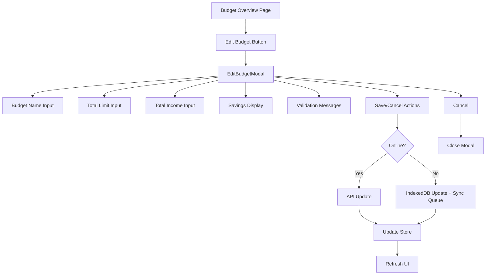
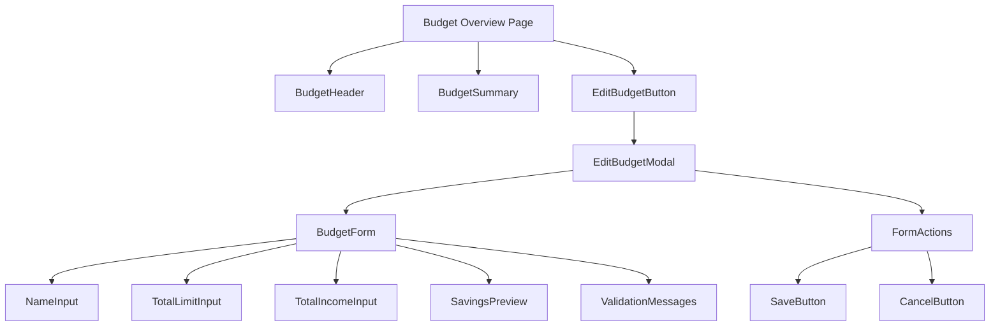

# Budget Editing & Total Income - Architectural Recommendation

## Executive Summary

This document provides comprehensive architectural guidance for implementing budget editing functionality and adding a total income field to the Budget Planner PWA. The design prioritizes user experience, data consistency, offline-first capabilities, and maintainability.

---

## Table of Contents

1. [Current State Analysis](#current-state-analysis)
2. [Database Schema Changes](#database-schema-changes)
3. [Budget Editing Architecture](#budget-editing-architecture)
4. [Total Income Field Integration](#total-income-field-integration)
5. [API Endpoint Design](#api-endpoint-design)
6. [Frontend Component Architecture](#frontend-component-architecture)
7. [Data Consistency & Validation](#data-consistency--validation)
8. [Offline/Sync Considerations](#offlinesync-considerations)
9. [Implementation Phases](#implementation-phases)
10. [Risk Assessment & Mitigation](#risk-assessment--mitigation)

---

## Current State Analysis

### Existing Budget Model

**Database Schema (PostgreSQL):**
```sql
CREATE TABLE budgets (
    id UUID PRIMARY KEY DEFAULT gen_random_uuid(),
    user_id UUID REFERENCES users(id) ON DELETE CASCADE,
    name VARCHAR(100),
    month DATE NOT NULL,
    total_limit DECIMAL(12, 2) NOT NULL,
    created_at TIMESTAMPTZ DEFAULT NOW(),
    updated_at TIMESTAMPTZ DEFAULT NOW(),
    deleted BOOLEAN DEFAULT FALSE,
    UNIQUE(user_id, month)
);
```

**Frontend Schema (IndexedDB):**
```typescript
interface Budget {
  id: string;
  userId: string;
  month: string; // Format: "YYYY-MM"
  totalLimit: number;
  createdAt: string;
  updatedAt: string;
}
```

### Current Limitations

1. **No Budget Editing**: Once created, budgets cannot be modified
2. **No Total Income Field**: Users cannot track income vs. spending
3. **Limited Budget Context**: No savings calculation (income - limit)
4. **No Edit History**: Cannot track budget changes over time

### Existing Infrastructure

- ✅ Backend `UpdateBudget` handler exists (supports name, total_limit)
- ✅ Frontend `updateBudget` API method exists
- ✅ Offline-first sync mechanism with conflict resolution
- ✅ IndexedDB stores for offline access
- ❌ No UI for budget editing
- ❌ No `total_income` field in schema
- ❌ No budget edit history tracking

---

## Database Schema Changes

### 1. Add `total_income` Field to Budgets Table

**Migration Script:**

```sql
-- Migration: 002_add_total_income_to_budgets.up.sql

-- Add total_income column (nullable for backward compatibility)
ALTER TABLE budgets 
ADD COLUMN total_income DECIMAL(12, 2);

-- Add comment for documentation
COMMENT ON COLUMN budgets.total_income IS 'Total income for the budget period. Used to calculate savings (income - limit).';

-- Update existing budgets: set total_income to NULL (user will need to fill in)
-- Alternative: Set to 0 if you want existing budgets to have a default
-- UPDATE budgets SET total_income = 0 WHERE total_income IS NULL;

-- Add index for queries filtering by income ranges (optional, for analytics)
CREATE INDEX idx_budgets_total_income ON budgets(total_income) WHERE NOT deleted;
```

**Rollback Script:**

```sql
-- Migration: 002_add_total_income_to_budgets.down.sql

DROP INDEX IF EXISTS idx_budgets_total_income;
ALTER TABLE budgets DROP COLUMN IF EXISTS total_income;
```

### 2. Consider Budget Edit History (Optional but Recommended)

**For audit trail and analytics:**

```sql
-- Migration: 003_add_budget_edit_history.up.sql

CREATE TABLE budget_edit_history (
    id UUID PRIMARY KEY DEFAULT gen_random_uuid(),
    budget_id UUID REFERENCES budgets(id) ON DELETE CASCADE,
    user_id UUID REFERENCES users(id) ON DELETE CASCADE,
    changed_fields JSONB NOT NULL,
    old_values JSONB NOT NULL,
    new_values JSONB NOT NULL,
    edit_reason TEXT,
    created_at TIMESTAMPTZ DEFAULT NOW()
);

CREATE INDEX idx_budget_edit_history_budget ON budget_edit_history(budget_id);
CREATE INDEX idx_budget_edit_history_user ON budget_edit_history(user_id);
CREATE INDEX idx_budget_edit_history_created ON budget_edit_history(created_at DESC);
```

### 3. Update Budget Model Types

**Backend (Go):**
```go
// BudgetResponse updated to include totalIncome
type BudgetResponse struct {
    ID         string  `json:"id"`
    UserID     string  `json:"userId"`
    Name       *string `json:"name,omitempty"`
    Month      string  `json:"month"`
    TotalLimit float64 `json:"totalLimit"`
    TotalIncome *float64 `json:"totalIncome,omitempty"` // NEW
    Savings    float64 `json:"savings"`                  // NEW: calculated
    Spent      float64 `json:"spent"`
    Remaining  float64 `json:"remaining"`
    CreatedAt  string  `json:"createdAt"`
    UpdatedAt  string  `json:"updatedAt"`
}

// UpdateBudgetRequest updated
type UpdateBudgetRequest struct {
    Name        *string  `json:"name,omitempty"`
    TotalLimit  *float64 `json:"totalLimit,omitempty"`
    TotalIncome *float64 `json:"totalIncome,omitempty"` // NEW
}
```

**Frontend (TypeScript):**
```typescript
// API types
export interface Budget {
    id: string;
    userId: string;
    name?: string;
    month: string; // Format: YYYY-MM-DD
    totalLimit: number;
    totalIncome?: number; // NEW - optional
    savings?: number;     // NEW - calculated
    spent: number;
    remaining: number;
    createdAt: string;
    updatedAt: string;
}

export interface UpdateBudgetRequest {
    name?: string;
    totalLimit?: number;
    totalIncome?: number; // NEW - optional
}

// IndexedDB schema
export interface Budget {
    id: string;
    userId: string;
    month: string; // Format: "YYYY-MM"
    totalLimit: number;
    totalIncome?: number; // NEW - optional
    createdAt: string;
    updatedAt: string;
}
```

---

## Budget Editing Architecture

### Recommendation: Modal-Based Editing

**Rationale:**

| Approach | Pros | Cons | Recommendation |
|----------|------|------|----------------|
| **Modal** | Focused context, easy to implement, consistent with create flow, good for mobile | Can feel disconnected from data | ✅ **RECOMMENDED** |
| Inline Edit | Direct manipulation, faster for quick changes | Complex UI, validation challenges, mobile unfriendly | ❌ Not recommended |
| Separate Page | Full context, detailed editing | Navigation overhead, overkill for simple edits | ❌ Not recommended |

### Component Architecture



### EditBudgetModal Component Design

**File:** `frontend/src/lib/components/budget/EditBudgetModal.svelte`

**Key Features:**
1. Reuse existing form patterns from CreateBudgetModal
2. Pre-populate with current budget data
3. Show calculated savings (income - limit)
4. Real-time validation
5. Loading states during save
6. Error handling and user feedback
7. Keyboard shortcuts (Enter to save, Escape to cancel)

**Props:**
```typescript
export let isOpen = false;
export let budget: Budget | null = null;
export let isSaving = false;
```

**Events:**
```typescript
dispatch('save', budgetData: UpdateBudgetRequest);
dispatch('cancel');
```

### Integration Points

**Budget Overview Page:**
```svelte
<script>
  import { currentMonthBudget } from '$lib/stores/budgets';
  import EditBudgetModal from '$lib/components/budget/EditBudgetModal.svelte';
  
  let editModalOpen = false;
  let isSaving = false;
  
  async function handleSave(budgetData) {
    isSaving = true;
    try {
      await updateBudget($currentMonthBudget.id, budgetData);
      editModalOpen = false;
      showToast('Budget updated successfully', 'success');
    } catch (error) {
      showToast('Failed to update budget', 'error');
    } finally {
      isSaving = false;
    }
  }
</script>

{#if $currentMonthBudget}
  <div class="budget-header">
    <h2>{$currentMonthBudget.name || 'Budget'}</h2>
    <button on:click={() => editModalOpen = true}>
      Edit Budget
    </button>
  </div>
{/if}

<EditBudgetModal
  bind:isOpen={editModalOpen}
  budget={$currentMonthBudget}
  bind:isSaving={isSaving}
  on:save={handleSave}
/>
```

---

## Total Income Field Integration

### Design Decisions

**1. Field Requirements:**
- **Optional**: Users may not want to track income
- **Nullable in database**: Backward compatible with existing budgets
- **Editable**: Can be updated after budget creation
- **Currency-aware**: Uses user's currency setting

**2. Savings Calculation:**
```typescript
// Automatic calculation in backend
savings = (totalIncome || 0) - totalLimit

// Display rules:
// - If totalIncome is null: don't show savings
// - If totalIncome >= totalLimit: show positive savings
// - If totalIncome < totalLimit: show negative (overspending warning)
```

**3. UI Display Strategy:**

| Scenario | Display | Color |
|----------|---------|-------|
| No income set | Hide savings section | N/A |
| Income > Limit | "Savings: $X" | Green |
| Income = Limit | "Savings: $0" | Gray |
| Income < Limit | "Over budget: $X" | Red |

### CreateBudgetModal Updates

**Add Total Income Field:**

```svelte
<!-- Total Income (Optional) -->
<div class="space-y-2">
  <Label for="totalIncome">
    Total Income
  </Label>
  <div class="relative">
    <span class="absolute left-4 top-1/2 -translate-y-1/2 text-gray-600">
      {currencySymbol}
    </span>
    <Input
      id="totalIncome"
      type="number"
      step="0.01"
      min="0"
      bind:value={totalIncome}
      placeholder="e.g., 5000"
      class="pl-10"
    />
  </div>
  <p class="text-xs text-gray-500 italic">
    Optional: Enter your total income for this month
  </p>
</div>

<!-- Savings Preview (shows when both limit and income are set) -->
{#if totalLimit && totalIncome}
  <div class="p-4 bg-blue-50 dark:bg-blue-900/20 rounded-lg">
    <div class="flex justify-between items-center">
      <span class="font-medium">Projected Savings:</span>
      <span class="text-lg font-bold {savings >= 0 ? 'text-green-600' : 'text-red-600'}">
        {currencySymbol}{Math.abs(savings).toFixed(2)}
      </span>
    </div>
  </div>
{/if}
```

**Form State Updates:**
```typescript
let totalIncome = ""; // New field

$: savings = calculateSavings(totalLimit, totalIncome);

function calculateSavings(limit: string, income: string): number | null {
  if (!limit || !income) return null;
  const limitVal = Number(limit);
  const incomeVal = Number(income);
  if (isNaN(limitVal) || isNaN(incomeVal)) return null;
  return incomeVal - limitVal;
}

function handleSubmit() {
  if (!validateForm()) return;
  
  const budgetData = {
    name: name.trim() || undefined,
    totalLimit: Number(totalLimit),
    totalIncome: totalIncome ? Number(totalIncome) : undefined, // New
  };
  
  dispatch("submit", budgetData);
  closeModal();
}
```

---

## API Endpoint Design

### Existing Endpoints (Already Implemented)

The backend already has the necessary endpoints:

```go
// PUT /api/budgets/{id}
func (h *BudgetHandler) UpdateBudget(w http.ResponseWriter, r *http.Request)
```

### Required Updates

**1. Update Budget Handler to Support Total Income:**

```go
// UpdateBudgetRequest - add totalIncome field
type UpdateBudgetRequest struct {
    Name        *string  `json:"name,omitempty"`
    TotalLimit  *float64 `json:"totalLimit,omitempty"`
    TotalIncome *float64 `json:"totalIncome,omitempty"` // NEW
}

// UpdateBudget handler - update to handle totalIncome
func (h *BudgetHandler) UpdateBudget(w http.ResponseWriter, r *http.Request) {
    budgetID := chi.URLParam(r, "id")
    if budgetID == "" {
        utils.BadRequest(w, "Budget ID is required")
        return
    }

    var req UpdateBudgetRequest
    if err := json.NewDecoder(r.Body).Decode(&req); err != nil {
        utils.BadRequest(w, "Invalid request body")
        return
    }

    // Validate: if totalIncome is provided, it must be >= 0
    if req.TotalIncome != nil && *req.TotalIncome < 0 {
        utils.BadRequest(w, "Total income cannot be negative")
        return
    }

    budget, err := h.queries.UpdateBudget(r.Context(), models.UpdateBudgetParams{
        ID:         budgetID,
        Name:       utils.PgTextPtr(req.Name),
        TotalLimit: utils.PgNumericPtr(req.TotalLimit),
        TotalIncome: utils.PgNumericPtr(req.TotalIncome), // NEW
    })
    if err != nil {
        utils.InternalError(w, "Failed to update budget")
        return
    }

    spent, _ := h.getBudgetSpent(r.Context(), budget.ID)
    totalLimit := utils.NumericToFloat64(budget.TotalLimit)
    totalIncome := utils.NumericToFloat64Ptr(budget.TotalIncome) // NEW
    savings := calculateSavings(totalIncome, totalLimit) // NEW

    utils.SendSuccess(w, BudgetResponse{
        ID:         budget.ID,
        UserID:     userID,
        Name:       name,
        Month:      month,
        TotalLimit: totalLimit,
        TotalIncome: totalIncome, // NEW
        Savings:    savings,       // NEW
        Spent:      spent,
        Remaining:  totalLimit - spent,
        CreatedAt:  createdAt,
        UpdatedAt:  updatedAt,
    })
}

// Helper function to calculate savings
func calculateSavings(totalIncome *float64, totalLimit float64) *float64 {
    if totalIncome == nil {
        return nil
    }
    savings := *totalIncome - totalLimit
    return &savings
}
```

**2. Update SQL Queries:**

```sql
-- Update query to include total_income
-- name: UpdateBudget :one
UPDATE budgets
SET
    name = COALESCE(sqlc.narg('name'), name),
    total_limit = COALESCE(sqlc.narg('total_limit'), total_limit),
    total_income = COALESCE(sqlc.narg('total_income'), total_income), -- NEW
    updated_at = NOW()
WHERE id = $1 AND deleted = false
RETURNING *;
```

**3. Frontend API Client (Already Compatible):**

```typescript
// frontend/src/lib/api/budgets.ts
export interface UpdateBudgetRequest {
    name?: string;
    totalLimit?: number;
    totalIncome?: number; // NEW - already supported by API client
}

async updateBudget(id: string, request: UpdateBudgetRequest): Promise<Budget> {
    return apiClient.put<Budget>(`/budgets/${id}`, request);
}
```

### Validation Rules

**Backend Validation:**
```go
// In UpdateBudget handler
if req.TotalLimit != nil && *req.TotalLimit <= 0 {
    utils.BadRequest(w, "Total limit must be positive")
    return
}

if req.TotalIncome != nil && *req.TotalIncome < 0 {
    utils.BadRequest(w, "Total income cannot be negative")
    return
}

// Optional: Warn if spending exceeds limit
spent, _ := h.getBudgetSpent(r.Context(), budgetID)
if req.TotalLimit != nil && spent > *req.TotalLimit {
    // Add warning header or include in response
    w.Header().Set("X-Budget-Warning", "Spending exceeds new limit")
}
```

**Frontend Validation:**
```typescript
function validateBudgetUpdate(data: UpdateBudgetRequest): { valid: boolean; errors: Record<string, string> } {
    const errors: Record<string, string> = {};
    let valid = true;

    if (data.totalLimit !== undefined) {
        if (data.totalLimit <= 0) {
            errors.totalLimit = "Total limit must be positive";
            valid = false;
        }
        if (data.totalLimit > 100000000) {
            errors.totalLimit = "Total limit exceeds maximum value";
            valid = false;
        }
    }

    if (data.totalIncome !== undefined) {
        if (data.totalIncome < 0) {
            errors.totalIncome = "Total income cannot be negative";
            valid = false;
        }
    }

    return { valid, errors };
}
```

---

## Frontend Component Architecture

### Component Hierarchy



### EditBudgetModal Implementation

**File Structure:**
```
frontend/src/lib/components/budget/
├── CreateBudgetModal.svelte (existing)
├── EditBudgetModal.svelte (new)
└── BudgetForm.svelte (shared form logic - optional refactor)
```

**EditBudgetModal.svelte:**
```svelte
<script lang="ts">
  import CustomModal from "$lib/components/ui/CustomModal.svelte";
  import { Button } from "$lib/components/ui/button";
  import { Input } from "$lib/components/ui/input";
  import { Label } from "$lib/components/ui/label";
  import { getCurrencySymbol } from "$lib/utils/format";
  import { createEventDispatcher } from "svelte";
  import type { Budget, UpdateBudgetRequest } from "$lib/api/budgets";

  export let isOpen = false;
  export let budget: Budget | null = null;
  export let isSaving = false;

  const dispatch = createEventDispatcher();

  // Form state
  let name = "";
  let totalLimit = "";
  let totalIncome = "";

  // Form errors
  let errors = {
    name: "",
    totalLimit: "",
    totalIncome: "",
  };

  // Initialize form when budget changes
  $: if (budget) {
    name = budget.name || "";
    totalLimit = String(budget.totalLimit);
    totalIncome = budget.totalIncome ? String(budget.totalIncome) : "";
  }

  // Computed values
  $: currencySymbol = getCurrencySymbol("USD"); // Use from settings store
  $: savings = calculateSavings(totalLimit, totalIncome);
  $: formValid = isFormValid();

  function calculateSavings(limit: string, income: string): number | null {
    if (!limit || !income) return null;
    const limitVal = Number(limit);
    const incomeVal = Number(income);
    if (isNaN(limitVal) || isNaN(incomeVal)) return null;
    return incomeVal - limitVal;
  }

  function isFormValid(): boolean {
    const limitValid = totalLimit && Number(totalLimit) > 0;
    const incomeValid = !totalIncome || Number(totalIncome) >= 0;
    return limitValid && incomeValid;
  }

  function validateForm(): boolean {
    errors = { name: "", totalLimit: "", totalIncome: "" };
    let valid = true;

    if (!totalLimit || Number(totalLimit) <= 0) {
      errors.totalLimit = "Total limit must be positive";
      valid = false;
    }

    if (totalIncome && Number(totalIncome) < 0) {
      errors.totalIncome = "Total income cannot be negative";
      valid = false;
    }

    return valid;
  }

  function closeModal() {
    isOpen = false;
    resetForm();
    dispatch("cancel");
  }

  function resetForm() {
    if (budget) {
      name = budget.name || "";
      totalLimit = String(budget.totalLimit);
      totalIncome = budget.totalIncome ? String(budget.totalIncome) : "";
    }
    errors = { name: "", totalLimit: "", totalIncome: "" };
  }

  function handleSubmit() {
    if (!validateForm()) return;

    const budgetData: UpdateBudgetRequest = {
      name: name.trim() || undefined,
      totalLimit: Number(totalLimit),
      totalIncome: totalIncome ? Number(totalIncome) : undefined,
    };

    dispatch("save", budgetData);
  }

  function handleKeydown(e: KeyboardEvent) {
    if (e.key === "Enter" && !e.shiftKey) {
      e.preventDefault();
      handleSubmit();
    } else if (e.key === "Escape") {
      closeModal();
    }
  }
</script>

<CustomModal
  bind:open={isOpen}
  title="Edit Budget"
  description="Update your budget settings"
  className="max-w-md"
>
  <form on:submit|preventDefault={handleSubmit} on:keydown={handleKeydown} class="space-y-6">
    <!-- Budget Name -->
    <div class="space-y-2">
      <Label for="name">Budget Name</Label>
      <Input
        id="name"
        bind:value={name}
        placeholder="e.g., Monthly Budget"
        maxlength="100"
      />
      {#if errors.name}
        <p class="text-sm text-red-500" role="alert">{errors.name}</p>
      {/if}
    </div>

    <!-- Total Limit -->
    <div class="space-y-2">
      <Label for="totalLimit">
        Total Limit <span class="text-red-500">*</span>
      </Label>
      <div class="relative">
        <span class="absolute left-4 top-1/2 -translate-y-1/2 text-gray-600">
          {currencySymbol}
        </span>
        <Input
          id="totalLimit"
          type="number"
          step="0.01"
          min="0"
          bind:value={totalLimit}
          class="pl-10"
          aria-invalid={errors.totalLimit ? "true" : "false"}
        />
      </div>
      {#if errors.totalLimit}
        <p class="text-sm text-red-500" role="alert">{errors.totalLimit}</p>
      {/if}
    </div>

    <!-- Total Income -->
    <div class="space-y-2">
      <Label for="totalIncome">Total Income</Label>
      <div class="relative">
        <span class="absolute left-4 top-1/2 -translate-y-1/2 text-gray-600">
          {currencySymbol}
        </span>
        <Input
          id="totalIncome"
          type="number"
          step="0.01"
          min="0"
          bind:value={totalIncome}
          class="pl-10"
          aria-invalid={errors.totalIncome ? "true" : "false"}
        />
      </div>
      {#if errors.totalIncome}
        <p class="text-sm text-red-500" role="alert">{errors.totalIncome}</p>
      {/if}
    </div>

    <!-- Savings Preview -->
    {#if savings !== null}
      <div class="p-4 rounded-lg {savings >= 0 ? 'bg-green-50 dark:bg-green-900/20' : 'bg-red-50 dark:bg-red-900/20'}">
        <div class="flex justify-between items-center">
          <span class="font-medium">Projected Savings:</span>
          <span class="text-lg font-bold {savings >= 0 ? 'text-green-600' : 'text-red-600'}">
            {currencySymbol}{Math.abs(savings).toFixed(2)}
          </span>
        </div>
      </div>
    {/if}

    <!-- Actions -->
    <div class="flex justify-end space-x-3 pt-6 border-t">
      <Button
        type="button"
        variant="outline"
        onclick={closeModal}
        disabled={isSaving}
      >
        Cancel
      </Button>
      <Button
        type="submit"
        disabled={isSaving || !formValid}
        class="min-w-[120px]"
      >
        {#if isSaving}
          <span class="flex items-center space-x-2">
            <span class="material-icons-outlined animate-spin text-sm">refresh</span>
            <span>Saving...</span>
          </span>
        {:else}
          <span class="flex items-center space-x-2">
            <span class="material-icons-outlined text-sm">save</span>
            <span>Save Changes</span>
          </span>
        {/if}
      </Button>
    </div>
  </form>
</CustomModal>
```

### Store Updates

**Update budget store to handle total income:**

```typescript
// frontend/src/lib/stores/budgets.ts

// Add updateBudget function
export async function updateBudget(
  budgetId: string,
  updates: Partial<Pick<Budget, 'name' | 'totalLimit' | 'totalIncome'>>
): Promise<Budget> {
  try {
    // Try API first
    if (USE_API) {
      try {
        const updated = await budgetsApi.updateBudget(budgetId, updates);
        
        // Update local store
        budgets.update(current => 
          current.map(b => b.id === budgetId ? { ...b, ...updates, updatedAt: updated.updatedAt } : b)
        );
        
        // Update IndexedDB
        const existing = await budgetStore.get(budgetId);
        if (existing) {
          await budgetStore.update({ ...existing, ...updates, updatedAt: updated.updatedAt });
        }
        
        return updated;
      } catch (error) {
        console.warn('[Budgets] API update failed, using local fallback:', error);
        showToast('Saved locally. Will sync when connection is restored.', 'warning');
      }
    }
    
    // Fallback: Update locally
    const existing = get(budgets).find(b => b.id === budgetId);
    if (!existing) {
      throw new Error('Budget not found');
    }
    
    const updated: Budget = {
      ...existing,
      ...updates,
      updatedAt: new Date().toISOString()
    };
    
    await budgetStore.update(updated);
    budgets.update(current => current.map(b => b.id === budgetId ? updated : b));
    
    // Queue for sync
    const { addToSyncQueue } = await import('$lib/db/sync');
    await addToSyncQueue({
      table: 'budgets',
      recordId: budgetId,
      operation: 'UPDATE',
      data: updated
    });
    
    return updated;
  } catch (error) {
    console.error('[Budgets] Error updating budget:', error);
    showToast(error instanceof Error ? error.message : 'Failed to update budget', 'error');
    throw error;
  }
}
```

---

## Data Consistency & Validation

### Validation Strategy

**1. Client-Side Validation (Immediate Feedback):**
- Real-time form validation
- Input type constraints (number, min, max)
- Field-level error messages
- Prevent invalid submissions

**2. Server-Side Validation (Final Authority):**
- Business rule enforcement
- Data integrity checks
- Permission verification
- Transaction safety

**3. Database Constraints (Last Line of Defense):**
- Column type constraints (DECIMAL(12, 2))
- NOT NULL constraints where applicable
- CHECK constraints for business rules
- Foreign key constraints

### Validation Rules

```typescript
// Budget validation rules
const BUDGET_VALIDATION_RULES = {
  name: {
    maxLength: 100,
    optional: true
  },
  totalLimit: {
    min: 0.01,
    max: 100000000, // 100 million
    required: true,
    precision: 2
  },
  totalIncome: {
    min: 0,
    max: 100000000,
    required: false,
    precision: 2
  }
};

function validateBudgetData(data: Partial<Budget>): ValidationResult {
  const errors: Record<string, string> = {};
  
  // Validate name
  if (data.name !== undefined) {
    if (data.name.length > BUDGET_VALIDATION_RULES.name.maxLength) {
      errors.name = `Name must be ${BUDGET_VALIDATION_RULES.name.maxLength} characters or less`;
    }
  }
  
  // Validate totalLimit
  if (data.totalLimit !== undefined) {
    if (data.totalLimit < BUDGET_VALIDATION_RULES.totalLimit.min) {
      errors.totalLimit = `Total limit must be at least ${BUDGET_VALIDATION_RULES.totalLimit.min}`;
    }
    if (data.totalLimit > BUDGET_VALIDATION_RULES.totalLimit.max) {
      errors.totalLimit = `Total limit cannot exceed ${BUDGET_VALIDATION_RULES.totalLimit.max}`;
    }
  }
  
  // Validate totalIncome
  if (data.totalIncome !== undefined) {
    if (data.totalIncome < BUDGET_VALIDATION_RULES.totalIncome.min) {
      errors.totalIncome = `Total income cannot be negative`;
    }
    if (data.totalIncome > BUDGET_VALIDATION_RULES.totalIncome.max) {
      errors.totalIncome = `Total income cannot exceed ${BUDGET_VALIDATION_RULES.totalIncome.max}`;
    }
  }
  
  return {
    valid: Object.keys(errors).length === 0,
    errors
  };
}
```

### Handling Budget Edits with Existing Transactions

**Scenario Analysis:**

| Scenario | Impact | Recommendation |
|----------|--------|----------------|
| Increase limit | More budget available | Allow, no warning |
| Decrease limit (still > spent) | Less budget remaining | Allow, show warning |
| Decrease limit (now < spent) | Over budget | Allow, show error/warning |
| Update income | Changes savings calculation | Allow, recalculate |

**Implementation:**

```go
// In UpdateBudget handler
func (h *BudgetHandler) UpdateBudget(w http.ResponseWriter, r *http.Request) {
    // ... existing code ...
    
    // Check if budget has transactions
    spent, _ := h.getBudgetSpent(r.Context(), budgetID)
    
    // Validate new limit against spent amount
    if req.TotalLimit != nil && spent > *req.TotalLimit {
        // Option 1: Reject the update
        // utils.BadRequest(w, "Cannot set limit below current spending")
        // return
        
        // Option 2: Allow with warning (RECOMMENDED)
        w.Header().Set("X-Budget-Warning", 
            fmt.Sprintf("Current spending (%.2f) exceeds new limit (%.2f)", spent, *req.TotalLimit))
        
        // Include warning in response
        response := BudgetResponse{ /* ... */ }
        response.Warning = "Spending exceeds new limit"
        utils.SendSuccess(w, response)
    }
    
    // ... rest of handler ...
}
```

**Frontend Warning Display:**

```svelte
<script>
  let warning: string | null = null;
  
  async function handleSave(budgetData) {
    isSaving = true;
    try {
      const response = await updateBudget($currentMonthBudget.id, budgetData);
      
      // Check for warning header
      if (response.warning) {
        warning = response.warning;
        showToast('Budget updated with warnings', 'warning');
      } else {
        showToast('Budget updated successfully', 'success');
        editModalOpen = false;
      }
    } catch (error) {
      showToast('Failed to update budget', 'error');
    } finally {
      isSaving = false;
    }
  }
</script>

{#if warning}
  <div class="p-4 bg-yellow-50 dark:bg-yellow-900/20 border-l-4 border-yellow-500">
    <p class="text-yellow-800 dark:text-yellow-200">{warning}</p>
  </div>
{/if}
```

### Edit History Tracking (Optional)

**If implementing budget_edit_history table:**

```go
// Helper function to log edit history
func (h *BudgetHandler) logBudgetEditHistory(ctx context.Context, budgetID, userID string, oldBudget, newBudget models.Budget, changes []string) error {
    oldValues := map[string]interface{}{
        "name": oldBudget.Name,
        "total_limit": oldBudget.TotalLimit,
        "total_income": oldBudget.TotalIncome,
    }
    
    newValues := map[string]interface{}{
        "name": newBudget.Name,
        "total_limit": newBudget.TotalLimit,
        "total_income": newBudget.TotalIncome,
    }
    
    changedFields := map[string]interface{}{}
    for _, field := range changes {
        changedFields[field] = true
    }
    
    _, err := h.queries.CreateBudgetEditHistory(ctx, models.CreateBudgetEditHistoryParams{
        BudgetID:     utils.PgUUID(budgetID),
        UserID:       utils.PgUUID(userID),
        ChangedFields: utils.PgJSONB(changedFields),
        OldValues:    utils.PgJSONB(oldValues),
        NewValues:    utils.PgJSONB(newValues),
    })
    
    return err
}

// In UpdateBudget handler
func (h *BudgetHandler) UpdateBudget(w http.ResponseWriter, r *http.Request) {
    // ... get old budget ...
    
    // ... update budget ...
    
    // ... detect changes ...
    changes := []string{}
    if (oldBudget.Name.Valid && !newBudget.Name.Valid) || 
       (!oldBudget.Name.Valid && newBudget.Name.Valid) ||
       (oldBudget.Name.Valid && newBudget.Name.Valid && oldBudget.Name.String != newBudget.Name.String) {
        changes = append(changes, "name")
    }
    // ... similar for total_limit and total_income ...
    
    // Log edit history if there are changes
    if len(changes) > 0 {
        h.logBudgetEditHistory(r.Context(), budgetID, userID, oldBudget, newBudget, changes)
    }
    
    // ... send response ...
}
```

---

## Offline/Sync Considerations

### Optimistic Updates vs Server Confirmation

**Recommendation: Optimistic Updates with Rollback**

**Rationale:**
- Provides immediate feedback
- Better UX for offline-first PWA
- Rollback on sync failure maintains data integrity

**Implementation:**

```typescript
// Optimistic update pattern
export async function updateBudgetOptimistic(
  budgetId: string,
  updates: Partial<Budget>
): Promise<Budget> {
  // 1. Store current state for rollback
  const currentState = get(budgets).find(b => b.id === budgetId);
  if (!currentState) throw new Error('Budget not found');
  
  // 2. Optimistically update UI
  const optimisticState = { ...currentState, ...updates, updatedAt: new Date().toISOString() };
  budgets.update(current => current.map(b => b.id === budgetId ? optimisticState : b));
  
  // 3. Update IndexedDB immediately
  await budgetStore.update(optimisticState);
  
  try {
    // 4. Try to sync with server
    if (get(isOnline)) {
      const serverResponse = await budgetsApi.updateBudget(budgetId, updates);
      
      // 5. Update with server response (may have additional fields)
      budgets.update(current => current.map(b => b.id === budgetId ? serverResponse : b));
      await budgetStore.update(serverResponse);
      
      return serverResponse;
    } else {
      // 6. If offline, queue for sync
      await addToSyncQueue({
        table: 'budgets',
        recordId: budgetId,
        operation: 'UPDATE',
        data: optimisticState
      });
      
      showToast('Saved locally. Will sync when connection is restored.', 'warning');
      return optimisticState;
    }
  } catch (error) {
    // 7. Rollback on failure
    console.error('[Budgets] Update failed, rolling back:', error);
    budgets.update(current => current.map(b => b.id === budgetId ? currentState : b));
    await budgetStore.update(currentState);
    
    showToast('Failed to update budget', 'error');
    throw error;
  }
}
```

### Conflict Resolution Strategy

**Existing Implementation (Timestamp-Based):**

The sync system already implements timestamp-based conflict resolution:

```typescript
// From frontend/src/lib/db/sync.ts
export function resolveConflict(localData: any, serverData: any): any {
  const localUpdatedAt = new Date(localData.updatedAt).getTime();
  const serverUpdatedAt = new Date(serverData.updatedAt).getTime();

  if (serverUpdatedAt > localUpdatedAt) {
    console.log('[Sync] Server data is newer, using server version');
    return serverData;
  } else if (localUpdatedAt > serverUpdatedAt) {
    console.log('[Sync] Local data is newer, using local version');
    return localData;
  } else {
    // Timestamps equal - server wins as tiebreaker
    console.log('[Sync] Timestamps equal, using server as tiebreaker');
    return serverData;
  }
}
```

**Enhanced Conflict Resolution for Budgets:**

For budget edits, consider field-level merging:

```typescript
export function resolveBudgetConflict(local: Budget, server: Budget): Budget {
  const localTime = new Date(local.updatedAt).getTime();
  const serverTime = new Date(server.updatedAt).getTime();
  
  // If one is clearly newer, use it entirely
  if (Math.abs(localTime - serverTime) > 5000) { // 5 second threshold
    return localTime > serverTime ? local : server;
  }
  
  // If timestamps are close, merge field-by-field
  const resolved: Budget = { ...local };
  
  // Use server's total_limit if it changed
  if (local.totalLimit !== server.totalLimit) {
    resolved.totalLimit = server.totalLimit;
  }
  
  // Use server's total_income if it changed
  if (local.totalIncome !== server.totalIncome) {
    resolved.totalIncome = server.totalIncome;
  }
  
  // Use server's name if it changed
  if (local.name !== server.name) {
    resolved.name = server.name;
  }
  
  resolved.updatedAt = new Date(Math.max(localTime, serverTime)).toISOString();
  
  return resolved;
}
```

### Sync Queue Integration

**Budget updates are already handled by the sync system:**

```typescript
// From frontend/src/lib/db/sync.ts
export async function addToSyncQueue(operation: Omit<SyncOperation, 'id' | 'timestamp' | 'status' | 'retryCount'>): Promise<void> {
  const syncOp: SyncOperation = {
    ...operation,
    id: crypto.randomUUID(),
    timestamp: new Date().toISOString(),
    status: 'pending',
    retryCount: 0
  };

  await syncQueueStore.create(syncOp);
  console.log('[Sync] Added to queue:', syncOp);
  await updatePendingCount();

  // Try to sync immediately if online
  if (get(isOnline)) {
    await processSyncQueue();
  }
}
```

**Backend Sync Handler (Ensure it handles budget updates):**

```go
// backend/internal/handlers/sync.go
func (h *SyncHandler) PushSyncOperations(w http.ResponseWriter, r *http.Request) {
    var req SyncPushRequest
    if err := json.NewDecoder(r.Body).Decode(&req); err != nil {
        utils.BadRequest(w, "Invalid request body")
        return
    }

    successful := []string{}
    failed := []SyncFailedOperation{}

    for _, op := range req.Operations {
        switch op.Table {
        case "budgets":
            err := h.syncBudgetOperation(op)
            if err != nil {
                failed = append(failed, SyncFailedOperation{
                    ID:    op.ID,
                    Error: err.Error(),
                })
            } else {
                successful = append(successful, op.ID)
            }
        // ... handle other tables ...
        }
    }

    utils.SendSuccess(w, map[string]interface{}{
        "successful": successful,
        "failed":     failed,
    })
}

func (h *SyncHandler) syncBudgetOperation(op SyncOperation) error {
    switch op.Operation {
    case "CREATE":
        // ... handle create ...
    case "UPDATE":
        var budgetData map[string]interface{}
        if err := json.Unmarshal(op.Data, &budgetData); err != nil {
            return err
        }
        
        // Extract fields
        budgetID := budgetData["id"].(string)
        name, _ := budgetData["name"].(string)
        totalLimit, _ := budgetData["totalLimit"].(float64)
        totalIncome, _ := budgetData["totalIncome"].(float64)
        
        // Update budget
        _, err := h.queries.UpdateBudget(r.Context(), models.UpdateBudgetParams{
            ID:         budgetID,
            Name:       utils.PgTextPtr(&name),
            TotalLimit: utils.PgNumericPtr(&totalLimit),
            TotalIncome: utils.PgNumericPtr(&totalIncome),
        })
        
        return err
    case "DELETE":
        // ... handle delete ...
    }
    
    return fmt.Errorf("unknown operation: %s", op.Operation)
}
```

### Offline UI Considerations

**Visual Indicators:**

```svelte
<script>
  import { isOnline, pendingSyncCount } from '$lib/stores/offline';
</script>

{#if !$isOnline}
  <div class="p-4 bg-yellow-50 dark:bg-yellow-900/20 border-l-4 border-yellow-500">
    <div class="flex items-center space-x-2">
      <span class="material-icons-outlined text-yellow-600">cloud_off</span>
      <span class="text-yellow-800 dark:text-yellow-200">
        You're offline. Changes will sync when you're back online.
      </span>
    </div>
    {#if $pendingSyncCount > 0}
      <p class="text-sm text-yellow-700 dark:text-yellow-300 mt-1">
        {$pendingSyncCount} pending change{plural($pendingSyncCount)}
      </p>
    {/if}
  </div>
{/if}
```

**Save Button State:**

```svelte
<Button
  type="submit"
  disabled={isSaving || !formValid}
  class="min-w-[120px]"
>
  {#if isSaving}
    <span class="flex items-center space-x-2">
      <span class="material-icons-outlined animate-spin text-sm">refresh</span>
      <span>{$isOnline ? 'Saving...' : 'Saving locally...'}</span>
    </span>
  {:else}
    <span class="flex items-center space-x-2">
      <span class="material-icons-outlined text-sm">save</span>
      <span>{$isOnline ? 'Save Changes' : 'Save (Offline)'}</span>
    </span>
  {/if}
</Button>
```

---

## Implementation Phases

### Phase 1: Database & Backend (Foundation)

**Tasks:**
1. ✅ Create migration to add `total_income` column
2. ✅ Update SQL queries to include `total_income`
3. ✅ Update Go models and handlers
4. ✅ Add validation for `total_income`
5. ✅ Update API response types
6. ✅ Add savings calculation
7. ✅ Test backend endpoints

**Estimated Complexity:** Medium
**Dependencies:** None
**Risk:** Low (backward compatible)

### Phase 2: Frontend API & Stores (Integration)

**Tasks:**
1. ✅ Update TypeScript interfaces
2. ✅ Update API client types
3. ✅ Update IndexedDB schema
4. ✅ Add `updateBudget` function to store
5. ✅ Update budget loading logic
6. ✅ Test API integration
7. ✅ Test offline fallback

**Estimated Complexity:** Medium
**Dependencies:** Phase 1
**Risk:** Low

### Phase 3: CreateBudgetModal Enhancement (Quick Win)

**Tasks:**
1. ✅ Add `totalIncome` field to form
2. ✅ Add savings preview display
3. ✅ Update form validation
4. ✅ Update form submission logic
5. ✅ Test budget creation with income
6. ✅ Test UI/UX

**Estimated Complexity:** Low
**Dependencies:** Phase 2
**Risk:** Low

### Phase 4: EditBudgetModal Component (Core Feature)

**Tasks:**
1. ✅ Create EditBudgetModal.svelte
2. ✅ Implement form with all fields
3. ✅ Add real-time validation
4. ✅ Implement save/cancel actions
5. ✅ Add loading states
6. ✅ Add error handling
7. ✅ Test modal interactions
8. ✅ Test keyboard shortcuts

**Estimated Complexity:** Medium
**Dependencies:** Phase 2
**Risk:** Low

### Phase 5: Budget Overview Integration (UI Integration)

**Tasks:**
1. ✅ Add "Edit Budget" button to overview
2. ✅ Integrate EditBudgetModal
3. ✅ Handle save events
4. ✅ Update UI after successful edit
5. ✅ Show warnings when over budget
6. ✅ Test end-to-end flow
7. ✅ Test offline editing

**Estimated Complexity:** Low
**Dependencies:** Phase 4
**Risk:** Low

### Phase 6: Polish & Testing (Quality Assurance)

**Tasks:**
1. ✅ Add unit tests for validation
2. ✅ Add integration tests for API
3. ✅ Add E2E tests for user flows
4. ✅ Test conflict resolution
5. ✅ Test offline scenarios
6. ✅ Performance testing
7. ✅ Accessibility audit
8. ✅ Cross-browser testing

**Estimated Complexity:** High
**Dependencies:** Phase 5
**Risk:** Medium

### Phase 7: Documentation & Deployment (Release)

**Tasks:**
1. ✅ Update API documentation
2. ✅ Update user documentation
3. ✅ Create migration guide
4. ✅ Update changelog
5. ✅ Deploy to staging
6. ✅ Perform smoke testing
7. ✅ Deploy to production
8. ✅ Monitor for issues

**Estimated Complexity:** Low
**Dependencies:** Phase 6
**Risk:** Low

---

## Risk Assessment & Mitigation

### Technical Risks

| Risk | Impact | Probability | Mitigation |
|------|--------|-------------|------------|
| **Migration failure** | High | Low | - Test migration in staging<br>- Create rollback script<br>- Backup database before migration |
| **Data corruption during sync** | High | Low | - Use transactions<br>- Implement conflict resolution<br>- Add data validation |
| **Performance degradation** | Medium | Low | - Add indexes for new queries<br>- Monitor query performance<br>- Optimize if needed |
| **API backward compatibility** | Medium | Low | - Make total_income nullable<br>- Use optional fields in types<br>- Version API if needed |
| **Offline sync conflicts** | Medium | Medium | - Implement timestamp-based resolution<br>- Add conflict resolution UI<br>- Test extensively |

### User Experience Risks

| Risk | Impact | Probability | Mitigation |
|------|--------|-------------|------------|
| **Confusion about savings calculation** | Medium | Medium | - Clear UI labels<br>- Help text<br>- Tooltips |
| **Unexpected over-budget warnings** | Low | Medium | - Clear error messages<br>- Explain why warning appears<br>- Allow override with confirmation |
| **Data loss during offline editing** | High | Low | - Optimistic updates with rollback<br>- Local storage persistence<br>- Sync queue |
| **Difficulty editing budgets** | Low | Medium | - Intuitive modal design<br>- Clear save/cancel actions<br>- Keyboard shortcuts |

### Business Risks

| Risk | Impact | Probability | Mitigation |
|------|--------|-------------|------------|
| **Users don't use total income field** | Low | High | - Make optional<br>- Show value (savings calculation)<br>- Educate in onboarding |
| **Budget editing causes data inconsistencies** | High | Low | - Strict validation<br>- Transaction safety<br>- Audit logging |
| **Migration downtime** | Medium | Low | - Use online schema change<br>- Test thoroughly<br>- Schedule during low traffic |

---

## Recommendations Summary

### Budget Editing Approach

✅ **Use Modal-Based Editing**
- Consistent with existing CreateBudgetModal
- Focused context for users
- Easy to implement
- Mobile-friendly

### Total Income Field

✅ **Add as Optional Field**
- Nullable in database
- Optional in forms
- Calculate savings automatically
- Display warnings when over budget

### Data Consistency

✅ **Implement Three-Layer Validation**
1. Client-side validation (immediate feedback)
2. Server-side validation (business rules)
3. Database constraints (data integrity)

✅ **Handle Budget Edits with Transactions**
- Allow decreasing limit even if over budget
- Show clear warnings
- Provide context about current spending

### Offline/Sync

✅ **Use Optimistic Updates**
- Immediate UI feedback
- Rollback on failure
- Queue for sync when offline

✅ **Enhance Conflict Resolution**
- Timestamp-based (existing)
- Field-level merging for budgets
- Server wins as tiebreaker

### Implementation Priority

1. **Phase 1-2**: Database & Backend (Foundation) - **DO FIRST**
2. **Phase 3**: CreateBudgetModal enhancement (Quick win)
3. **Phase 4-5**: EditBudgetModal & Integration (Core feature)
4. **Phase 6-7**: Testing & Deployment (Quality assurance)

### Future Enhancements

1. **Budget Edit History** (audit trail)
2. **Budget Versioning** (compare changes)
3. **Budget Templates** (reuse previous budgets)
4. **Income Categories** (track income sources)
5. **Budget Analytics** (trends over time)

---

## Appendix: Code Examples

### A. Complete Migration Script

```sql
-- File: backend/sql/schema/002_add_total_income_to_budgets.up.sql

BEGIN;

-- Add total_income column
ALTER TABLE budgets 
ADD COLUMN total_income DECIMAL(12, 2);

-- Add comment
COMMENT ON COLUMN budgets.total_income IS 'Total income for the budget period. Used to calculate savings (income - limit).';

-- Add index for analytics queries
CREATE INDEX idx_budgets_total_income ON budgets(total_income) WHERE NOT deleted;

COMMIT;
```

### B. Complete EditBudgetModal Component

(See Section: Frontend Component Architecture)

### C. Complete UpdateBudget Handler

(See Section: API Endpoint Design)

### D. Sync Queue Integration

(See Section: Offline/Sync Considerations)

---

## Conclusion

This architectural recommendation provides a comprehensive, phased approach to implementing budget editing and total income functionality in the Budget Planner PWA. The design prioritizes:

- **User Experience**: Modal-based editing, real-time validation, clear feedback
- **Data Consistency**: Three-layer validation, transaction safety, conflict resolution
- **Offline-First**: Optimistic updates, sync queue, rollback on failure
- **Maintainability**: Clean architecture, phased implementation, comprehensive testing

The implementation is backward compatible, low-risk, and can be delivered incrementally. Start with Phase 1-2 (database & backend) to establish the foundation, then proceed with frontend implementation in phases 3-5.

---

**Document Version:** 1.0  
**Last Updated:** 2026-01-03  
**Author:** Architect Mode  
**Status:** Ready for Review
