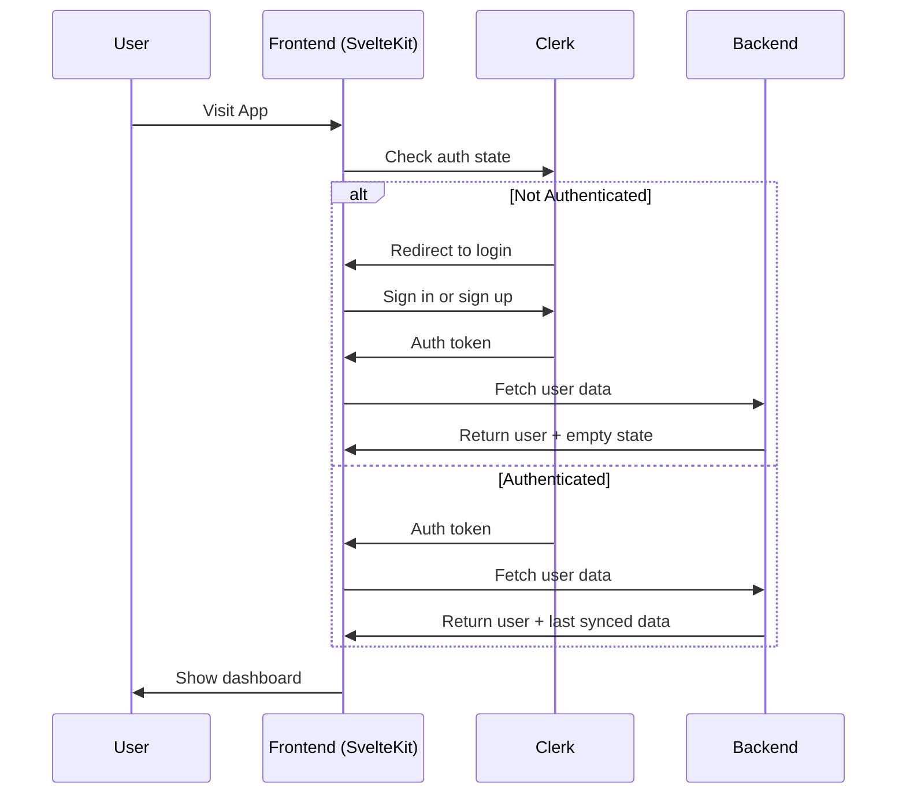
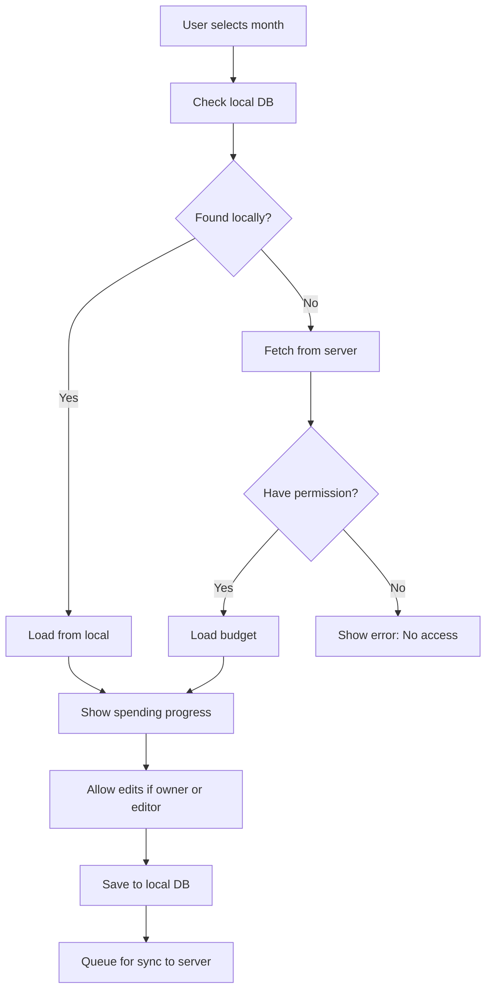
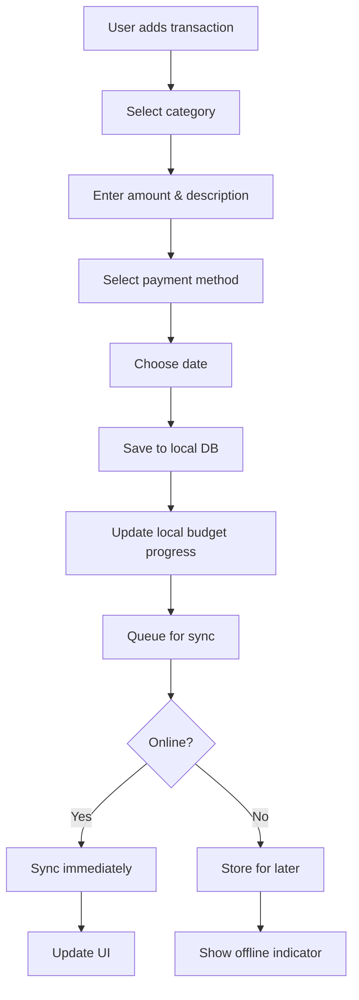
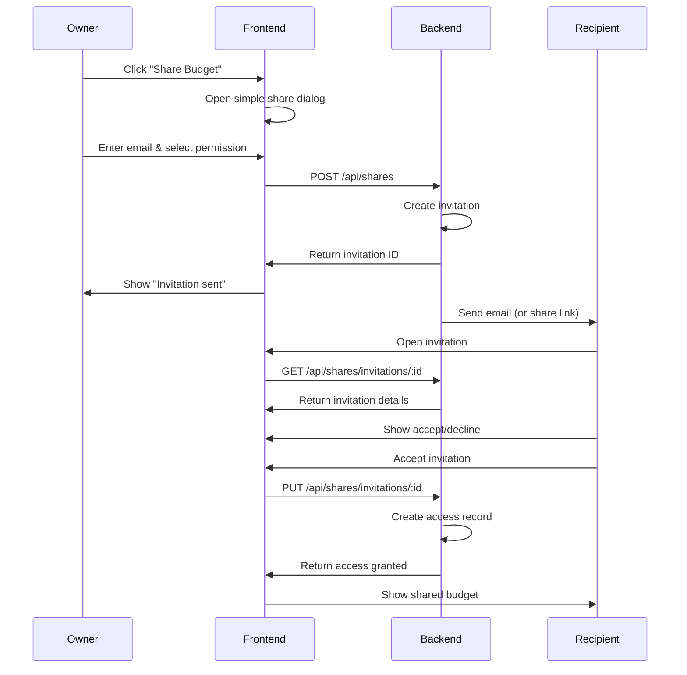
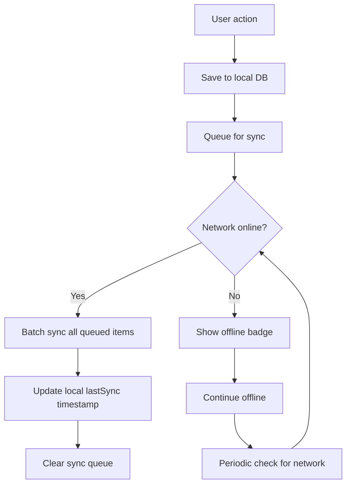
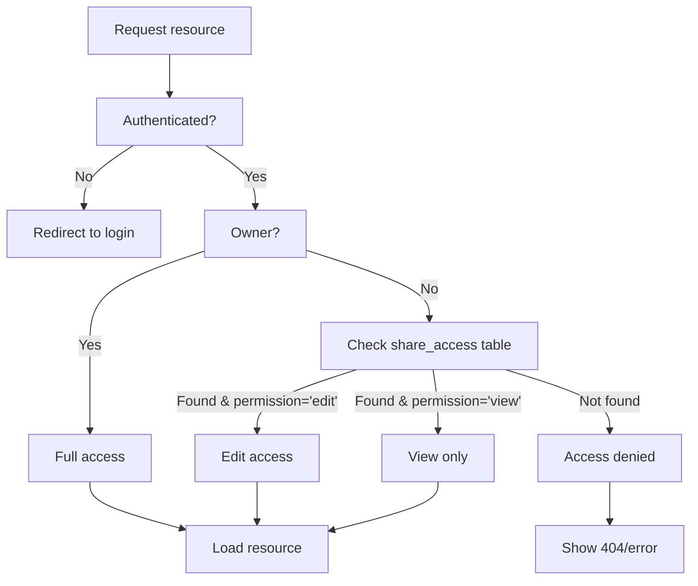
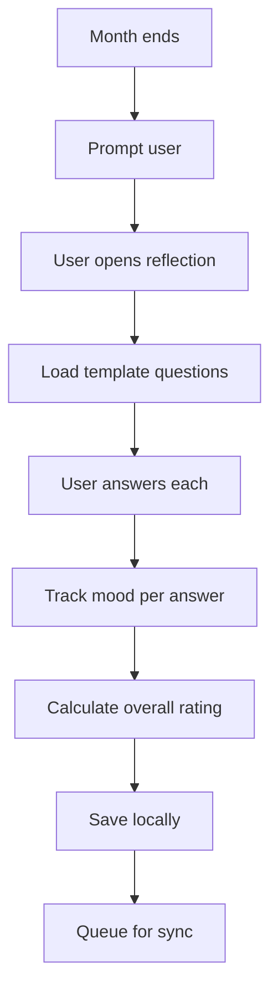
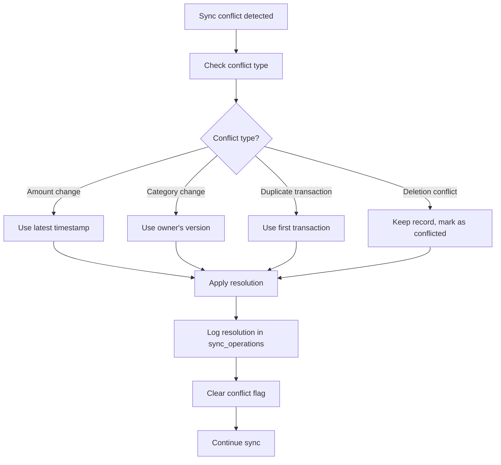

## Solution Background

Solution: Budget Planner that's a PWA offline first 

### Frontend

- **Framework**: SvelteKit PWA
- UI Library: [Shadcn-Svelte](https://www.shadcn-svelte.com)
- **CSS**: Tailwind CSS
- **Offline Storage**: IndexedDB with simple sync queue
- **Auth**: Clerk SDK

### Backend 
- **Language**: Go (Golang)
- **Framework**: **[Chi](https://github.com/go-chi/chi)**
- **Database**: PostgreSQL
- **ORM**: **[sqlc](https://sqlc.dev/)** 


## UI Pages

## Project Structure
```
budget-planner/
├── frontend/          # SvelteKit PWA
├── backend/
│   ├── cmd/api/       # main.go
│   ├── internal/
│   │   ├── auth/      # Clerk integration
│   │   ├── database/  # PostgreSQL connection
│   │   ├── models/    # Go structs
│   │   ├── handlers/  # HTTP handlers
│   │   ├── middleware/# Auth, logging, etc.
│   │    └── sync/      # Sync logic
│   ├── sql/schema/    # SQL migrations
│    └── sql/queries/   # SQL queries (.sql files for sqlc)
└── docker-compose.yml
```

## Database Schema
### Users Table

```sql
CREATE TABLE users (
    id UUID PRIMARY KEY DEFAULT gen_random_uuid(),
    clerk_user_id VARCHAR(255) UNIQUE NOT NULL,
    email VARCHAR(255) UNIQUE NOT NULL,
    name VARCHAR(255),
    currency VARCHAR(3) DEFAULT 'PHP',
    created_at TIMESTAMPTZ DEFAULT NOW(),
    updated_at TIMESTAMPTZ DEFAULT NOW(),
    deleted BOOLEAN DEFAULT FALSE
);
```

### Categories Table

```sql
CREATE TABLE categories (
    id UUID PRIMARY KEY DEFAULT gen_random_uuid(),
    user_id UUID REFERENCES users(id) ON DELETE CASCADE,
    name VARCHAR(100) NOT NULL,
    icon VARCHAR(10),
    color VARCHAR(7) DEFAULT '#3498db',
    is_system BOOLEAN DEFAULT FALSE, -- true for default categories (Food, Transport, etc.)
    default_limit DECIMAL(12, 2),
    created_at TIMESTAMPTZ DEFAULT NOW(),
    updated_at TIMESTAMPTZ DEFAULT NOW(),
    deleted BOOLEAN DEFAULT FALSE
);
```

### Budgets Table

```sql
CREATE TABLE budgets (
    id UUID PRIMARY KEY DEFAULT gen_random_uuid(),
    user_id UUID REFERENCES users(id) ON DELETE CASCADE,
    name VARCHAR(100), -- ADDED: Optional budget name
    month DATE NOT NULL, -- First day of month
    total_limit DECIMAL(12, 2) NOT NULL,
    created_at TIMESTAMPTZ DEFAULT NOW(),
    updated_at TIMESTAMPTZ DEFAULT NOW(),
    deleted BOOLEAN DEFAULT FALSE,
    UNIQUE(user_id, month)
);
```

### Budget Categories (Many-to-Many)

```sql
CREATE TABLE budget_categories (
    id UUID PRIMARY KEY DEFAULT gen_random_uuid(),
    budget_id UUID REFERENCES budgets(id) ON DELETE CASCADE,
    category_id UUID REFERENCES categories(id) ON DELETE CASCADE,
    limit_amount DECIMAL(12, 2) NOT NULL,
    created_at TIMESTAMPTZ DEFAULT NOW(),
    updated_at TIMESTAMPTZ DEFAULT NOW(),
    UNIQUE(budget_id, category_id) -- One limit per category per budget
);
```

### Payment Methods Table

```sql
CREATE TABLE payment_methods (
    id UUID PRIMARY KEY DEFAULT gen_random_uuid(),
    user_id UUID REFERENCES users(id) ON DELETE CASCADE,
    name VARCHAR(100) NOT NULL,
    type VARCHAR(50) NOT NULL, -- 'credit_card', 'debit_card', 'cash', 'ewallet'
    last_four VARCHAR(4),
    brand VARCHAR(50),
    is_default BOOLEAN DEFAULT FALSE,
    is_active BOOLEAN DEFAULT TRUE,
    credit_limit DECIMAL(12, 2),
    current_balance DECIMAL(12, 2),
    created_at TIMESTAMPTZ DEFAULT NOW(),
    updated_at TIMESTAMPTZ DEFAULT NOW(),
    deleted BOOLEAN DEFAULT FALSE
);
```

### Transactions Table

```sql
CREATE TABLE transactions (
    id UUID PRIMARY KEY DEFAULT gen_random_uuid(),
    user_id UUID REFERENCES users(id) ON DELETE CASCADE,
    budget_id UUID REFERENCES budgets(id) ON DELETE SET NULL,
    category_id UUID REFERENCES categories(id) ON DELETE SET NULL,
    payment_method_id UUID REFERENCES payment_methods(id) ON DELETE SET NULL,
    amount DECIMAL(12, 2) NOT NULL,
    type VARCHAR(10) DEFAULT 'expense', -- ADDED: 'expense', 'income', 'transfer'
    is_transfer BOOLEAN DEFAULT FALSE, -- ADDED: True if transfer between accounts
    transfer_to_account_id UUID, -- For transfers between payment methods
    description VARCHAR(255),
    transaction_date DATE NOT NULL DEFAULT CURRENT_DATE,
    is_recurring BOOLEAN DEFAULT FALSE,
    recurrence_pattern JSONB, -- {frequency: 'monthly', interval: 1, endDate: null}
    created_at TIMESTAMPTZ DEFAULT NOW(),
    updated_at TIMESTAMPTZ DEFAULT NOW(),
    deleted BOOLEAN DEFAULT FALSE
);
```

### Reflections Table

```sql
CREATE TABLE reflections (
    id UUID PRIMARY KEY DEFAULT gen_random_uuid(),
    user_id UUID REFERENCES users(id) ON DELETE CASCADE,
    budget_id UUID REFERENCES budgets(id) ON DELETE CASCADE,
    overall_rating INTEGER CHECK (overall_rating >= 1 AND overall_rating <= 10),
    is_private BOOLEAN DEFAULT TRUE,
    created_at TIMESTAMPTZ DEFAULT NOW(),
    updated_at TIMESTAMPTZ DEFAULT NOW(),
    deleted BOOLEAN DEFAULT FALSE,
    UNIQUE(user_id, budget_id) -- One reflection per budget
);
```

### Reflection Questions Table

```sql
CREATE TABLE reflection_questions (
    id UUID PRIMARY KEY DEFAULT gen_random_uuid(),
    reflection_id UUID REFERENCES reflections(id) ON DELETE CASCADE,
    sequence INTEGER DEFAULT 0, -- ADDED: Order of questions
    question_id VARCHAR(50) NOT NULL,
    question_text TEXT NOT NULL,
    answer TEXT,
    mood VARCHAR(20),
    created_at TIMESTAMPTZ DEFAULT NOW(),
    updated_at TIMESTAMPTZ DEFAULT NOW()
);
```

### Reflection Templates Table

```sql
CREATE TABLE reflection_templates (
    id UUID PRIMARY KEY DEFAULT gen_random_uuid(),
    name VARCHAR(100) NOT NULL,
    is_active BOOLEAN DEFAULT TRUE,
    version INTEGER DEFAULT 1,
    created_at TIMESTAMPTZ DEFAULT NOW(),
    updated_at TIMESTAMPTZ DEFAULT NOW()
);
```

### Template Questions Table

```sql
CREATE TABLE template_questions (
    id UUID PRIMARY KEY DEFAULT gen_random_uuid(),
    template_id UUID REFERENCES reflection_templates(id) ON DELETE CASCADE,
    question_id VARCHAR(50) NOT NULL,
    question_text TEXT NOT NULL,
    type VARCHAR(20) DEFAULT 'text',
    is_required BOOLEAN DEFAULT TRUE,
    has_mood_tracking BOOLEAN DEFAULT TRUE,
    sort_order INTEGER DEFAULT 0,
    created_at TIMESTAMPTZ DEFAULT NOW(),
    updated_at TIMESTAMPTZ DEFAULT NOW(),
    UNIQUE(template_id, question_id)
);
```

### Share Invitations Table

```sql
CREATE TABLE share_invitations (
    id UUID PRIMARY KEY DEFAULT gen_random_uuid(),
    budget_id UUID REFERENCES budgets(id) ON DELETE CASCADE,
    owner_id UUID REFERENCES users(id) ON DELETE CASCADE,
    recipient_email VARCHAR(255) NOT NULL,
    permission VARCHAR(10) NOT NULL CHECK (permission IN ('view', 'edit')),
    status VARCHAR(20) DEFAULT 'pending' CHECK (status IN ('pending', 'accepted', 'declined', 'expired')),
    expires_at TIMESTAMPTZ DEFAULT (NOW() + INTERVAL '7 days'),
    created_at TIMESTAMPTZ DEFAULT NOW(),
    updated_at TIMESTAMPTZ DEFAULT NOW()
);
```

### Share Access Table

```sql
CREATE TABLE share_access (
    id UUID PRIMARY KEY DEFAULT gen_random_uuid(),
    budget_id UUID REFERENCES budgets(id) ON DELETE CASCADE,
    owner_id UUID REFERENCES users(id) ON DELETE CASCADE,
    shared_with_id UUID REFERENCES users(id) ON DELETE CASCADE,
    permission VARCHAR(10) NOT NULL CHECK (permission IN ('view', 'edit')),
    created_at TIMESTAMPTZ DEFAULT NOW(),
    UNIQUE(budget_id, shared_with_id) -- One access per user per budget
);
```

### Sync Table (For Offline Sync)

```sql
CREATE TABLE sync_operations (
    id UUID PRIMARY KEY DEFAULT gen_random_uuid(),
    user_id UUID REFERENCES users(id) ON DELETE CASCADE,
    table_name VARCHAR(50) NOT NULL,
    record_id UUID NOT NULL,
    operation VARCHAR(10) NOT NULL, -- 'create', 'update', 'delete'
    local_data JSONB, -- The data from frontend
    server_data JSONB, -- The data on server (before applying)
    status VARCHAR(20) DEFAULT 'pending', -- 'pending', 'synced', 'failed', 'conflict'
    error_message TEXT,
    attempt_count INTEGER DEFAULT 0,
    last_attempt_at TIMESTAMPTZ,
    created_at TIMESTAMPTZ DEFAULT NOW(),
    updated_at TIMESTAMPTZ DEFAULT NOW()
);
```

### Activity Log Table

```sql
CREATE TABLE activity_log (
    id UUID PRIMARY KEY DEFAULT gen_random_uuid(),
    user_id UUID REFERENCES users(id) ON DELETE CASCADE,
    action VARCHAR(50) NOT NULL, -- 'budget_created', 'transaction_added', 'share_sent'
    resource_type VARCHAR(50),
    resource_id UUID,
    details JSONB,
    ip_address INET,
    user_agent TEXT,
    created_at TIMESTAMPTZ DEFAULT NOW()
);
```

## Critical Indexes

```sql
-- To speed up common queries

-- Transactions (most queries filter by month/year)
CREATE INDEX idx_transactions_user_month ON transactions(user_id, DATE_TRUNC('month', transaction_date));
CREATE INDEX idx_transactions_date ON transactions(transaction_date);

-- Budgets (for monthly lookups)
CREATE INDEX idx_budgets_month ON budgets(month) WHERE NOT deleted;

-- Categories (user-specific categories)
CREATE INDEX idx_categories_user_active ON categories(user_id) WHERE NOT deleted AND NOT is_system;

-- Performance for permission checks
CREATE INDEX idx_share_access_shared_with ON share_access(shared_with_id) WHERE permission = 'edit';
CREATE INDEX idx_share_invitations_email ON share_invitations(recipient_email);

-- For sync operations
CREATE INDEX idx_sync_operations_created ON sync_operations(created_at DESC);
CREATE INDEX idx_sync_operations_attempt ON sync_operations(attempt_count) WHERE status = 'failed';
```
## API Endpoints

### Authentication

- `POST /api/auth/login` - User authentication
- `POST /api/auth/logout` - User logout
- `GET /api/auth/me` - Get current user info
- `POST /api/auth/refresh` - Refresh token

### Users (Admin/Self Only)

- `GET /api/users/me` - Get current user profile
- `PUT /api/users/me` - Update current user profile
- `DELETE /api/users/me` - Delete current user account

### Budgets

- `GET /api/budgets/:month` - Get budget for specific month (e.g., 2025-01)
- `GET /api/budgets` - List all user budgets
- `POST /api/budgets` - Create new budget
- `PUT /api/budgets/:id` - Update budget
- `DELETE /api/budgets/:id` - Delete budget
- `POST /api/budgets/:id/categories` - Add category to budget
- `PUT /api/budgets/:id/categories/:categoryId` - Update category limit
- `DELETE /api/budgets/:id/categories/:categoryId` - Remove category from budget
- `PUT /api/budgets/:id/sharing-settings` - Update sharing settings
- `GET /api/budgets/shared` - Get budgets shared with current user

### Transactions

- `GET /api/transactions?category=&startDate=&endDate=&budgetMonth=&limit=&offset=` - List transactions with filters
- `GET /api/transactions/:id` - Get specific transaction
- `POST /api/transactions` - Create new transaction
- `PUT /api/transactions/:id` - Update transaction
- `DELETE /api/transactions/:id` - Delete transaction
- `POST /api/transactions/bulk` - Batch operations

### Categories

- `GET /api/categories` - Get user's categories
- `GET /api/categories/system` - Get system default categories
- `POST /api/categories` - Create custom category
- `PUT /api/categories/:id` - Update category
- `DELETE /api/categories/:id` - Delete category

### Sync

- `POST /api/sync/push` - Push local changes to server
- `POST /api/sync/pull` - Pull server changes to local
- `GET /api/sync/status` - Check sync status
- `POST /api/sync/resolve-conflict` - Handle conflict resolution

### Payment Methods

- `GET /api/payment-methods` - List user payment methods
- `POST /api/payment-methods` - Add new payment method
- `PUT /api/payment-methods/:id` - Update payment method
- `DELETE /api/payment-methods/:id` - Remove payment method

### Reflections

- `GET /api/reflections/:month` - Get reflection for specific month
- `GET /api/reflections` - List user reflections
- `POST /api/reflections` - Create new reflection
- `PUT /api/reflections/:id` - Update reflection
- `DELETE /api/reflections/:id` - Delete reflection
- `GET /api/reflections/shared` - Get reflections shared with user

### Reflection Templates

- `GET /api/reflection-templates` - Get available templates
- `POST /api/reflection-templates` - Create new template (admin only)
- `PUT /api/reflection-templates/:id` - Update template (admin only)
- `DELETE /api/reflection-templates/:id` - Delete template (admin only)

### Analytics & Reports

- `GET /api/dashboard/:month` - Dashboard summary for month
- `GET /api/reports/spending/:month` - Spending breakdown for month
- `GET /api/reports/trends` - Historical spending trends
- `GET /api/reports/category/:categoryId` - Category-specific report

### Sharing Management

- `POST /api/shares` - Create share invitation
- `GET /api/shares/invitations` - Get my invitations
- `PUT /api/shares/invitations/:id` - Accept/decline invitation
- `DELETE /api/shares/invitations/:id` - Cancel invitation (owner only)
- `GET /api/shares/budgets/:budgetId` - Get who has access
- `DELETE /api/shares/:id` - Remove someone's access


## Workflow Architecture

### 1. **User Onboarding & Authentication**


### 2. **Budget Management Workflow**


### 3. **Transaction Recording**


### 4. **Simplified Sharing Workflow** 


### 5. **Offline-First Sync**


### 6. **Permission & Access Checks**


### 7. **Monthly Reflection**


### 8. **Conflict Resolution (Simplified)**


